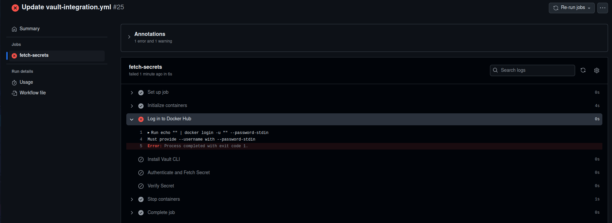

Сначала на своем ноутбуке скачал vault

Дальше я запустил Vault в dev-режиме

Дальше я экспортировал переменные среды для CLI:

Дальше я настроил секрет Vault

Дальше я начал устанавливать токен Vault в GitHub Secrets и понял, что в чужом репозитории у меня нет прав заходить в настройки. Поэтому данная лаба выполнена в другом репозитории.
В своем уже репозитории я зашел в настройки и добавил токен

Теперь я создал в папке workflows файл vault-integration.yml

Зашел в Actions и понял, что Vault я настраивал локально, а Github Actions запускает workflow в своей облачной инфраструктуре...

Я нашел решение этой проблемы с помощью запуска Vault с помощью docker в Github Actions

Первым делом я переписал vault-integration.yml

Новый конфиг создает временный Vault сервер в контейнере прямо в процессе выполнения workflow. Все действия с секретами происходят локально для CI/CD.

Но в нем была обнаружена ошибка, использовалась версия vault latest, а не какая-то конкретная, в новом конфиге указана конкретная версия 1.15.4

Это все еще не помогло, оказывается надо зарегистрироваться в Docker Hub...

Зарегистрировался и добавил новый секрет, и строчки в yml.

Ошибка осталась, возможно в Docker Hub нет этой версии vault, и, действительно, версии после 14 не поддерживаются, поэтому поменял версию на 1.13.3

Теперь появилась проблема с пунктом Log in to Docker Hub

Тут я хотел вставить как я пытаюсь исправить ошибку, но я исправлял ее кучу раз и ничего не работало, а в итоге как оказалось я неправильно понял что такое секреты и не то писал в название и секрет.....
Теперь есть два секрета, и с докер хабом все работает

Но как можно увидеть появилась новая проблема(

Я добавил пункты проверки правильно ли работает Vault. Как выяснилось все обращения к localhost надо заменить на 127.0.0.1

