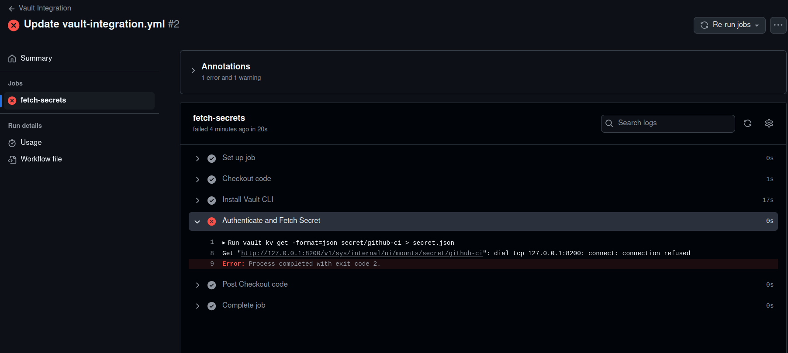
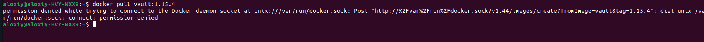

# Лабораторная №4 по DevOps

### Выполнили:

**Орлова Алёна (К3223)**  
**Феофанов Никита (К3222)**  
**Зубов Алексей (К3220)**  

---

## **Почему другой репозиторий?**

Так как владелец основного репозитория спал, а мне нужен был доступ к настройкам секретов репозитория, был вынужден создать свой и выполнить лабу в нем

---

## **Что такое HashiCorp Vault?**

HashiCorp Vault — это инструмент для управления секретами и обеспечения безопасности данных. Он используется для хранения, доступа и управления конфиденциальной информацией, такой как API-ключи, токены, пароли и сертификаты. В рамках данной лабораторной работы мы интегрировали Vault с GitHub Actions для демонстрации управления секретами в CI/CD.

---

## **Процесс выполнения**

### Установка Vault и настройка dev-режима

1. **Скачивание Vault:**  
   Vault был установлен на ноутбуке, как показано на скриншоте:  
   

2. **Запуск Vault в dev-режиме:**  
   Vault запущен в dev-режиме для локального тестирования.  
   

3. **Экспорт переменных среды для CLI:**  
   Настроены переменные для работы через командную строку.  
   

4. **Настройка секретов в Vault:**  
   Секрет был успешно добавлен.  
   

---

### Интеграция Vault с GitHub Actions

5. **Добавление токена Vault в GitHub Secrets:**  
   Поначалу возникла проблема с правами в чужом репозитории. Лаба была выполнена в своём репозитории.  
   

6. **Создание файла vault-integration.yml:**  
   Создан файл для интеграции Vault в CI/CD.  
   

7. **Обнаружение проблемы:**  
   Vault настраивался локально, но GitHub Actions запускает workflow в облаке.  
   

---

### Решение проблемы через Docker

8. **Запуск Vault в контейнере:**  
   Для решения проблемы Vault был запущен через Docker в GitHub Actions.  
   

9. **Исправление ошибок:**  
   Указана конкретная версия Vault (1.13.3), так как версии после 1.14 не поддерживаются.  
   

10. **Авторизация в Docker Hub:**  
    Добавлены секреты для авторизации в Docker Hub.  
    

11. **Решение проблемы с Docker Hub:**  
    Секреты исправлены, теперь авторизация проходит успешно, но появилась новая ошибка.  
      
    

---

### После долгих неудачных попыток настроить все через docker, решил сделать через ngrok

12. **Запуск Vault через ngrok:**  
    После неудачных попыток настроить Vault в GitHub Actions было принято решение использовать ngrok.  
    

13. **Тестирование работы:**  
    Проверена работа Vault через curl.  
    

14. **Настройка workflow:**  
    Написан новый workflow для получения секретов API_KEY и DB_PASSWORD.  
    

15. **Результат:**  
    Все шаги workflow успешно завершены.  
    

---

## **Почему способ с использованием Vault является красивым?**

1. **Безопасность:** Секреты не хранятся в открытом виде в репозитории, а передаются напрямую из защищённого хранилища.  
2. **Гибкость:** Секреты могут обновляться в хранилище без необходимости менять конфигурации CI/CD пайплайна.  
3. **Прозрачность:** Отслеживание доступа к секретам в Vault позволяет видеть, какие данные и кем использовались.  
4. **Масштабируемость:** Легко добавлять новые секреты для использования в других пайплайнах или сервисах.  

---

## **Почему хранение секретов в CI/CD переменных репозитория — плохая практика?**

1. **Отсутствие централизованного управления:** Все секреты в репозитории разбросаны, и их сложно обновлять или удалять.  
2. **Уязвимость к утечкам:** Если доступ к репозиторию будет скомпрометирован, все секреты также окажутся под угрозой.  
3. **Ограниченная защита:** Переменные репозитория обычно менее защищены по сравнению с специализированными инструментами, такими как Vault.  
4. **Нет контроля версий:** Любые изменения в секретах в репозитории сложно отследить.  

---

## **Результаты и выводы**

- **Проблемы:**  
  - Vault, настроенный локально, не мог быть использован в GitHub Actions.  
  - Версии Vault в Docker оказались неподдерживаемыми.  
  - Неправильно настроенные секреты вызвали ошибки авторизации.  

- **Решения:**  
  - Vault был запущен в контейнере для работы в GitHub Actions.  
  - При невозможности использования Docker был применён ngrok для проксирования локального Vault.  

- **Уроки:**  
  - Важно указывать фиксированные версии ПО.  
  - Секреты должны быть корректно настроены, иначе workflow не выполнится.  
  - Решение проблем требует анализа логов и внимательной проверки настроек.  

Лабораторная работа продемонстрировала важность управления секретами и интеграции их в CI/CD, а также выявила сложности, которые могут возникнуть при работе с облачной инфраструктурой.
